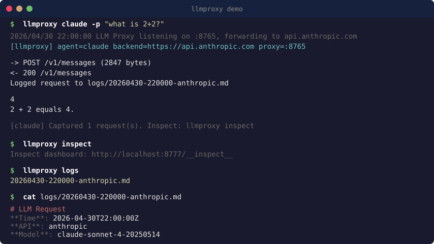

# llmproxy

A transparent reverse proxy that intercepts and logs LLM API requests from any coding agent. Inspired by [proxychains](https://github.com/haad/proxychains) — just wrap your command and it captures all prompt traffic, including hidden system prompts.

Supports **Anthropic**, **OpenAI**, and **Gemini** APIs, including streaming responses and WebSocket-based Realtime API.

## System Prompt Extraction

llmproxy can extract and save the **full system prompts** that coding agents send to LLMs — prompts that are normally hidden from the user. Every request is inspected and the system prompt is saved to a per-agent snapshot file:

```
logs/
├── claude/
│   ├── prompt.md          ← current Claude Code system prompt
│   └── prompt-20260505-*.md
├── codex/
│   ├── prompt.md          ← current Codex system prompt
│   └── ...
```

Works across all supported agents and API formats:
- **Anthropic**: extracts the `system` field (string and content block arrays)
- **OpenAI**: extracts `system` role messages from the `messages` array
- **Codex (WebSocket)**: extracts the `instructions` field from Realtime API events

<p align="center">
  
</p>

## Supported Agents

| Agent | Command | Auto-detected |
|-------|---------|:---:|
| Claude Code | `llmproxy claude -p "hello"` | Yes |
| OpenAI Codex | `llmproxy codex "fix the bug"` | Yes |
| Aider | `llmproxy aider --model gpt-4o "refactor"` | Yes |
| OpenCode | `llmproxy opencode` | Yes |
| Gemini CLI | `llmproxy gemini -p "explain this"` | Yes |
| Any other | `llmproxy <command> [args...]` | Best-effort |

## Install

Requirements: [Go](https://go.dev/) 1.22+, `jq` (for Claude Code only)

```bash
git clone https://github.com/ViperBlackSkull/llmproxy.git
cd llmproxy
make build
```

## Usage

```bash
# Claude Code
./llmproxy claude -p "hello"

# OpenAI Codex
./llmproxy codex "fix the bug"

# Aider (auto-detects OpenAI or Anthropic based on --model)
./llmproxy aider --model gpt-4o "refactor auth"
./llmproxy aider --model claude-sonnet-4-20250514 "fix tests"

# OpenCode
./llmproxy opencode

# Gemini CLI
./llmproxy gemini -p "explain this code"

# Any command — sets all known env vars
./llmproxy curl -X POST http://localhost:8765/v1/messages ...

# List captured logs
./llmproxy logs

# Open inspect dashboard
./llmproxy inspect
```

The proxy starts automatically, intercepts all API traffic, and shuts down when your command finishes.

### Inspect Dashboard

```bash
./llmproxy inspect          # Start on port 8777
./llmproxy inspect 9090     # Custom port
```

Opens a web UI at `http://localhost:8777/__inspect__` where you can browse captured requests, view system prompts, and inspect raw JSON.

### Standalone Mode

Run the proxy daemon directly (no wrapper):

```bash
go run . # listens on :8765, forwards to api.anthropic.com
```

Then point any tool at `http://localhost:8765`.

## Security Notice

llmproxy is a **local development tool** for inspecting your own LLM API traffic. It is designed to run on `localhost` only.

- The MITM/TLS interception features (`lib/intercept.c`, `lib/redirect.c`, `examples/grab.py`) are intended for **authorized testing and research** on your own machines.
- The inspect dashboard binds to localhost and has no authentication — do not expose it to a network.
- API keys are read from environment variables, never hardcoded. Keep your `.env` files out of version control (they're in `.gitignore`).
- Do not use this tool to intercept traffic you are not authorized to intercept.

## Configuration

All config via environment variables. Copy `.env.example` to `.env` and fill in your keys:

```bash
cp .env.example .env
# Edit .env with your actual API keys
```

| Variable | Default | Description |
|----------|---------|-------------|
| `ANTHROPIC_API_KEY` | — | Your Anthropic API key |
| `OPENAI_API_KEY` | — | Your OpenAI API key |
| `GEMINI_API_KEY` | — | Your Google Gemini API key |
| `BACKEND_URL` | Auto-detected per agent | Upstream API to forward to |
| `PROXY_PORT` | First available from 8765-8770 | Proxy listen port |
| `LOG_DIR` | `./logs` | Directory for captured logs |
| `LISTEN_ADDR` | `:8765` | Proxy listen address (standalone mode) |

## How It Works

Inspired by [proxychains](https://github.com/haad/proxychains): instead of chaining through SOCKS/HTTP proxies, llmproxy chains your coding agent through a local intercepting proxy that logs all LLM traffic — no agent configuration or plugins required.

```
Agent (claude, codex, aider, etc.)
  │
  ├── Env vars set to point at local proxy
  │   (Claude Code: also patches settings.json)
  │
  ▼
llmproxyd (:8765)
  ├── Detects API type (Anthropic / OpenAI / Gemini)
  ├── Extracts system prompt (saves to prompt.md)
  ├── Logs request (system prompt, messages)
  ├── Forwards to real API
  ├── Captures response (including SSE streams)
  └── Logs response
  │
  ▼
api.anthropic.com / api.openai.com / generativelanguage.googleapis.com
```

1. `llmproxy` wrapper detects which agent you're running
2. Sets the appropriate env vars so the agent routes through the proxy
3. `llmproxyd` intercepts requests, logs them as markdown, forwards to the real API
4. On exit, settings are restored and a summary is printed

## Log Format

Logs are stored as markdown files in `./logs/`:

```markdown
# LLM Request

**Time**: 2026-04-30T14:52:00Z
**API**: anthropic
**Model**: claude-sonnet-4-20250514

## System Prompt

You are a helpful assistant...

## Messages

**user**: Hello!

## Response

Hi there! How can I help?
```

Raw request JSON is also saved as `.req.json` alongside each log.

## License

[MIT](LICENSE)
