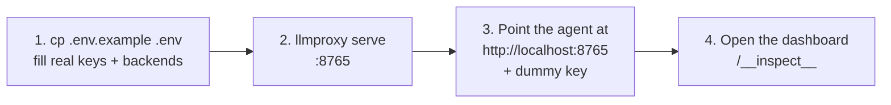

# Agent Setup Overview

How to wire each supported coding agent to llmproxy **credential-free**: the
agent's config holds only a dummy key, the proxy holds the only real
credentials, and every request/response is captured to logs and the live
dashboard.

## The shared story — four steps

1. **Configure** — `cp .env.example .env` and fill in the real API key(s) and
   upstream backend(s). `.env` is gitignored; it is the **only** place real
   credentials live.
2. **Serve** — `./llmproxy serve` (default `http://localhost:8765`,
   loopback-bound).
3. **Wire the agent** — per its guide below: set its base URL to
   `http://localhost:8765` and give it a dummy key where it refuses to run
   without one. The proxy strips the dummy and injects the real key upstream.
4. **Observe** — open `http://localhost:8765/__inspect__` (needs
   `LLMPROXY_INSPECT_TOKEN` from `.env` as a bearer header or `?token=`);
   requests stream in live.

## Per-agent guides

| Guide | Agent |
|---|---|
| [[Claude-Code-Setup]] | Claude Code (`~/.claude/settings.json`) |
| [[Codex-Setup]] | Codex CLI (`~/.codex/config.toml`) |
| [[OpenCode-Setup]] | OpenCode (`~/.config/opencode/opencode.json`) |
| [[Pi-Setup]] | Pi coding agent (`~/.pi/agent/`) |

## Comparison table

| Agent | Config file | Env vars (in agent config) | Dummy key needed? | Status |
|---|---|---|---|---|
| Claude Code | `~/.claude/settings.json` → `env` | `ANTHROPIC_BASE_URL`, `ANTHROPIC_AUTH_TOKEN` | Yes (startup refuses without one) | ⏳ pending live test — Phase 04 |
| Codex | `~/.codex/config.toml` → `model_providers.llmproxy` | `OPENAI_API_KEY` in the **shell** (via `env_key`) | Yes (`env_key` must resolve) | ⏳ pending live test — Phase 04 |
| OpenCode | `~/.config/opencode/opencode.json` → `provider.llmproxy` | — (dummy lives in `options.apiKey`) | Recommended (SDK contract) | ⏳ pending live test — Phase 04 |
| Pi | `~/.pi/agent/providers.json` + `~/.pi/agent/llmproxy/settings.json` | `ANTHROPIC_BASE_URL`, `ANTHROPIC_AUTH_TOKEN` (+ OpenAI pair) | Yes (profile env shape) | ⏳ pending live test — Phase 04 |

Live-test status and results land in [[Agent-Test-Matrix]] (created in Phase
04 — this link is intentionally forward).

## Routing reality — which `.env` backend each agent hits

The daemon classifies every request by URL path (`detectAPIType` in
`main.go`) and routes self-referential traffic (agent pointed at the proxy) to
the matching backend from `.env`:

| Agent emits | Path matches | Backend (`.env` var) | Key injected (`.env` var) |
|---|---|---|---|
| Anthropic-style (`/v1/messages`) — Claude Code, Pi default | `/messages` | `ANTHROPIC_BACKEND` | `ANTHROPIC_API_KEY` |
| OpenAI-style (`/v1/chat/completions`) — OpenCode, Codex with `wire_api = "chat"` | `chat/completions` | `OPENAI_BACKEND` | `OPENAI_API_KEY` |
| OpenAI Responses (`/v1/responses`) — Codex with `wire_api = "responses"` | `/responses` | `OPENAI_BACKEND` | `OPENAI_API_KEY` |
| Gemini-style (`…/models/<model>:generateContent`) | `generateContent` | `GEMINI_BACKEND` | `GEMINI_API_KEY` |

> [!IMPORTANT]
> A path type with **no corresponding backend + key in `.env`** falls through
> to that provider's public default (e.g. `https://api.openai.com`) with no
> credential → upstream 401. If you set up only the Anthropic side (z.ai) and
> then wire Codex or OpenCode, you must also add to `.env`:
> `OPENAI_API_KEY=<real key>` and `OPENAI_BACKEND=https://api.z.ai/api/coding/paas/v4`.

Model names are remapped before forwarding via `MODEL_MAP` (first matching
rule wins; unmatched names pass through). The mechanics and the classic
Claude → GLM rules are explained in [[Claude-Code-Setup]].

## Security model

- **`.env` holds the only real credentials** — gitignored, `0600`, loaded by
  the daemon at startup (real environment variables win over `.env` values).
- **Agents hold dummies only** — any auth an agent sends to the proxy is
  stripped and replaced on forward, so a leaked agent config leaks nothing.
- **The dashboard is token-gated** — `/__inspect__*` returns 404 until
  `LLMPROXY_INSPECT_TOKEN` is set, and then requires it (bearer header or
  `?token=`). It renders prompts verbatim: keep the token private.
- **Loopback binding** — `serve` binds `127.0.0.1` by default; do not widen
  `LISTEN_ADDR` on shared networks (the containerized-Pi case in
  [[Pi-Setup]] is the one documented exception).
- Logs (`./logs/`) carry full prompts with `0700`/`0600` permissions and
  redacted secrets — treat them as sensitive too.
